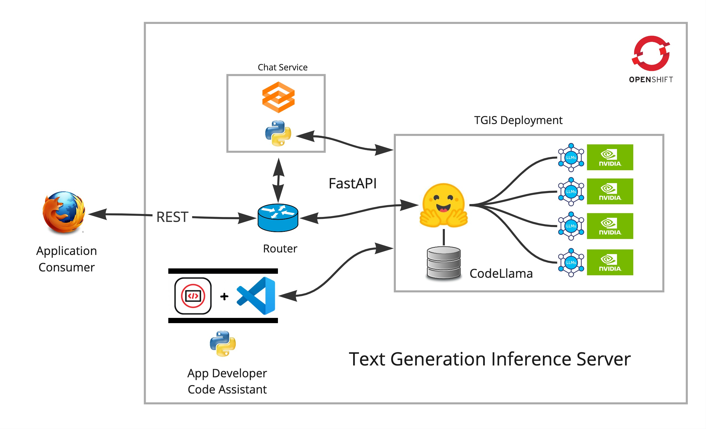

# demo-ai-tgis
Text Generation Inference Server with DevSpaces Code-Llama assistant

## Work in progress...



### What's Needed
- [Openshift v4.13 with a worker node that has (4) NVIDIA T4 GPUs](https://github.com/redhat-na-ssa/demo-ai-gitops-catalog)

1. Deploy the model server and wait a few minutes.
```
oc new-project tgi
oc apply -k resources/base
```

Get the route.
```
export INFERENCE_URL = get the route
```
Verify the model server is running by visiting the [Swagger docs]${INFERENCE_URL}

2. Deploy the Gradio test chat app.

```bash
oc new-app python~https://github.com/redhat-na-ssa/demo-ai-tgis.git --name=chat --env=INFERINFERENCE_URL=${INFERENCE_URL}
```

```bash
oc create route edge --service=chat --insecure-policy='Redirect'
```

3. Fire up DevSpaces and let the Llama help you code!

Need to add the correct `devfile.yaml` and instructions here.

Install and configure the llm-huggingface extension with the internal http://tgi:8084 endpoint.

